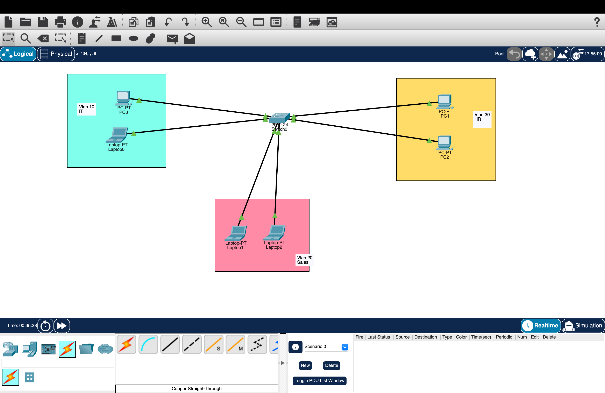
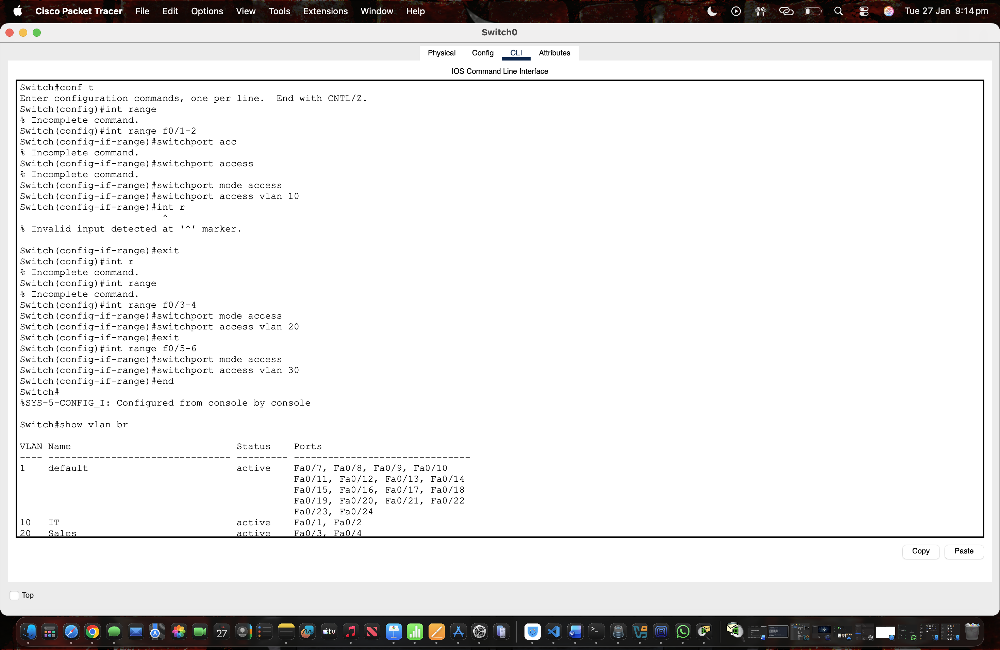
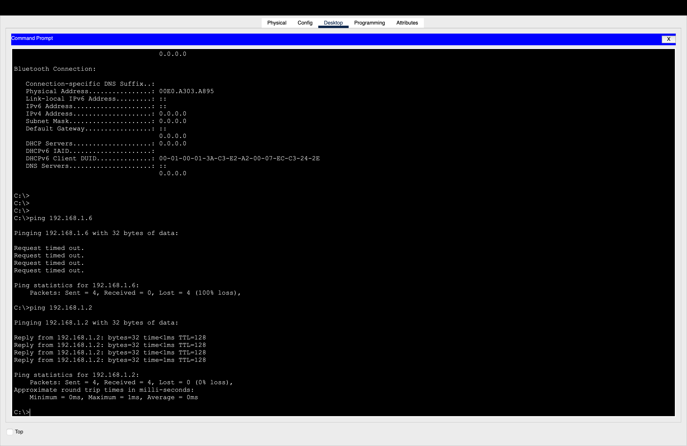

# Lab 02 – VLAN Segmentation Using a Switch

## Objective
The objective of this lab was to create and configure multiple VLANs on a switch
to logically segment a network based on departments.

## VLAN Configuration

| VLAN ID | Name  | Department |
|------|------|-----------|
| 10 | IT | Information Technology |
| 20 | Sales | Sales Department |
| 30 | HR | Human Resources |

## Network Topology
The network consists of a single switch with multiple end devices assigned
to different VLANs.

## Configuration Performed
- Created VLANs 10, 20, and 30
- Assigned meaningful VLAN names
- Configured switch access ports for each VLAN
- Verified VLAN configuration using `show vlan brief`

## Security Concepts Applied
- Network segmentation
- Broadcast domain isolation
- Reduced lateral movement between departments

## Verification
Devices within the same VLAN can communicate with each other.
Devices in different VLANs are isolated, which is expected behavior
without inter-VLAN routing.

## Network Topology

## VLAN Verification

## Ping test

## What I Learned
- VLANs logically separate networks at Layer 2
- Proper port assignment is critical
- VLANs improve security and performance
